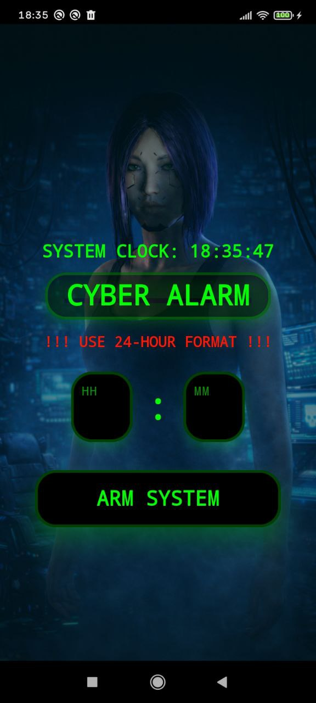
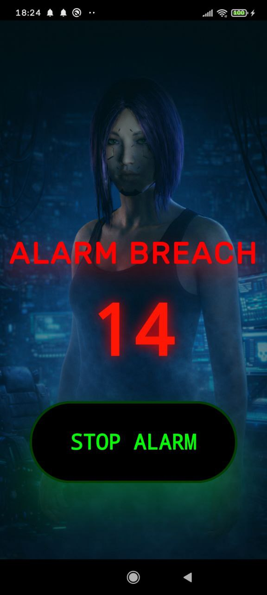

# CyberAlarm (Кибер-Будильник)

Стильный будильник в стиле Cyberpunk Modern, построенный на Jetpack Compose. Проект сочетает в себе агрессивную эстетику будущего с надежным функционалом пробуждения.

## 🚀 Особенности

- **Cyberpunk Aesthetic**: Атмосферный фон в стиле Cyberpunk, неоновое свечение (Vignette effect), кастомные шрифты и формы.
- **Анимированный интерфейс**: Динамические эффекты при срабатывании и плавные переходы.
- **Техно-саундтрек**: Встроенная энергичная мелодия в стиле киберпанк (`alarm_sound.mp3`) для гарантированного пробуждения.
- **Таймер срабатывания**: При звонке отображается счетчик секунд, прошедших с момента активации — узнайте, как долго вы сопротивлялись системе.
- **Навязчивый режим**: Будильник использует `Foreground Service` и `WakeLock`, чтобы гарантированно звучать, пока вы не нажмете кнопку "STOP ALARM".
- **Работа поверх блокировки**: Использует `FullScreenIntent` для мгновенного отображения экрана будильника даже на заблокированном устройстве.
- **Системные часы**: Постоянное отображение точного времени для синхронизации с реальностью.

## 🛠 Технологии

- **Jetpack Compose**: Полностью декларативный UI.
- **Kotlin 2.0.0**: Использование современных возможностей языка.
- **Material 3**: Современные компоненты с кастомной стилизацией.
- **AlarmManager**: Использование `setAlarmClock` для максимальной точности даже в режиме энергосбережения.

## 📸 Скриншоты

> **Примечание**: Для отображения скриншотов в этом README, создайте папку `screenshots/` в корне проекта и загрузите туда изображения с именами `main_screen.jpg` и `ringing_screen.jpg`.

| Главный экран | Экран срабатывания |
|:---:|:---:|
|  |  |

## ⚙️ Требования и запуск

- **JDK**: 17+
- **Android Studio**: Jellyfish+
- **Min SDK**: 24 (Android 7.0)
- **Target SDK**: 34 (Android 14)

### Как запустить:
1. Клонируйте репозиторий.
2. Откройте проект в Android Studio.
3. Дождитесь синхронизации Gradle.
4. Запустите на устройстве или эмуляторе (рекомендуется API 30+).

## ⚠️ Важные нюансы
- **24-часовой формат**: Система настроена на работу в 24-часовом режиме. Будьте внимательны при вводе времени.
- **Разрешения**: Приложению требуются права на уведомления и запуск поверх других окон.

## 📂 Структура проекта
- `MainActivity.kt`: Главная панель управления и установка времени.
- `AlarmService.kt`: Сердце системы — управление звуком, вибрацией и уведомлениями.
- `AlarmRingingActivity.kt`: Интерфейс "вторжения" с таймером и кнопкой деактивации.
- `AlarmReceiver.kt`: Низкоуровневый перехватчик системных событий.
